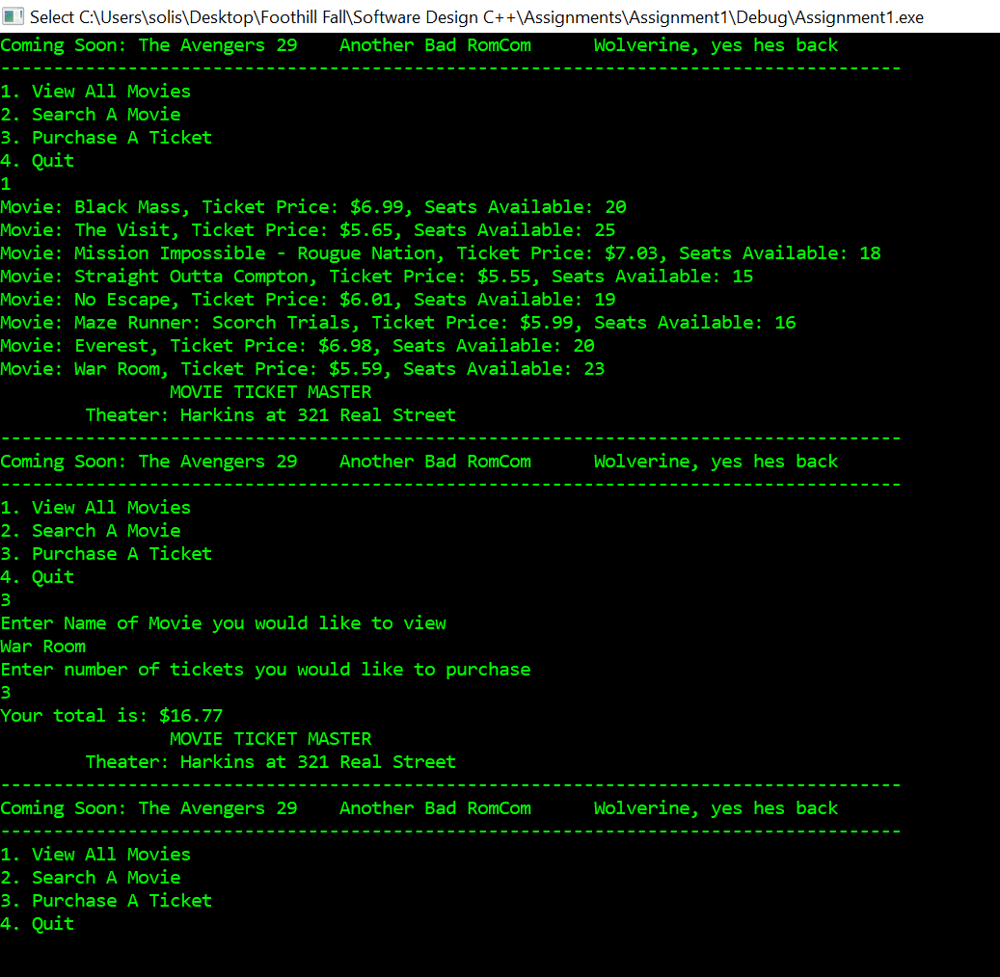
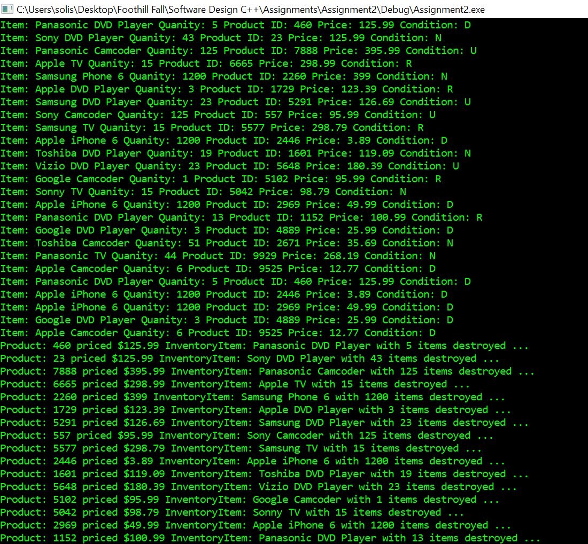
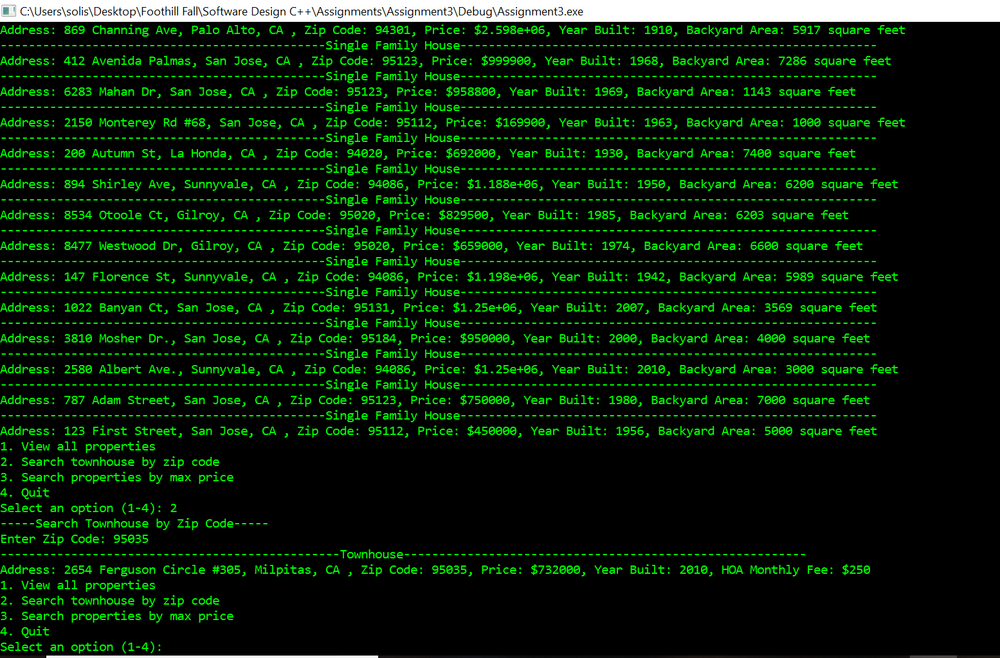
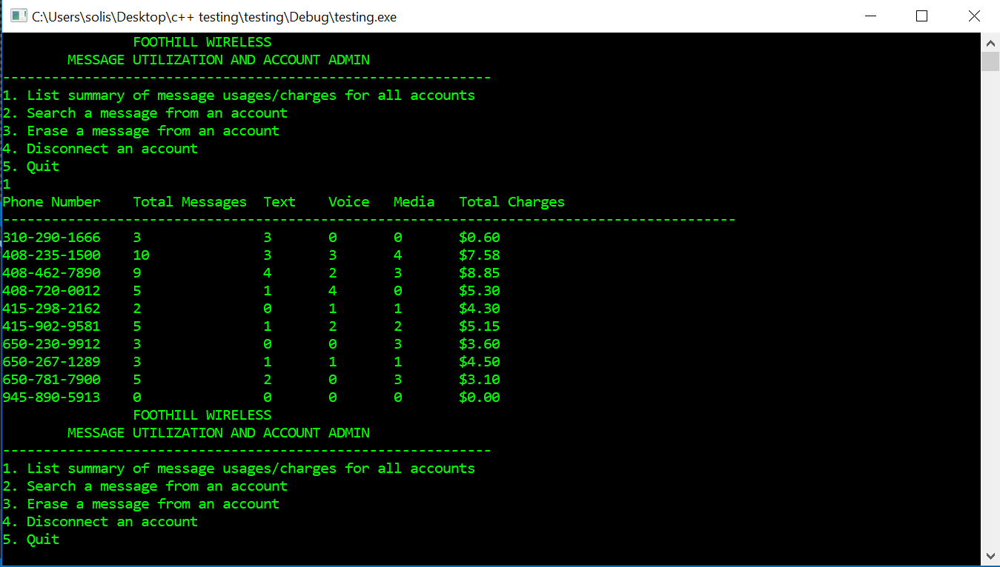

# Software Design and Algorithms
Assignments and Projects for Foothill College CS2B Software Design and CS2C Algorithms (in C++)

# CS2B Software Design
## Assignment 1
Simple Movie Interface implemented with classes and pointers.

## Assignment 2
Inventory interface reads in product_list.txt and inventories objects. Implemented with classes, inheritance and dynamic memory allocation.

## Assignment 3
Real Estate inventory system interface. Implemented with virtual classes and inheritance.

## Assignment 4
Wireless Phone Service interface. Implemented with virtual classes, inheritance, dynamic memory, operator overloading

# CS2C Algorithms
## Project 1
Sparse Matrice implemented with template classes
## Sample Output:
//-----------------------------------------------output from screen--------------------------------------------------
//0       0       0       0       0       0       0       0       0       0       0       0       0       0       0
//
//0       0       0       0       0       35      0       0       0       0       0       0       0       0       0
//
//0       0       0       0       0       0       0       0       0       21      0       0       0       0       0
//
//0       0       0       0       0       0       0       0       0       0       0       0       0       0       0
//
//0       0       0       0       0       0       0       0       0       0       0       0       0       0       0
//
//0       0       0       0       0       0       0       0       0       0       0       0       0       0       0
//
//0       0       0       0       0       0       0       0       0       0       0       0       0       0       0
//
//0       0       0       0       0       0       0       0       0       0       0       0       0       0       0
//
//0       0       0       0       0       0       0       0       0       21      0       0       0       0       0
//
//0       0       0       0       0       0       0       0       0       0       0       0       0       0       0
//
//0       0       0       0       0       0       0       0       0       0       0       0       0       0       0
//
//0       0       0       0       0       0       0       0       0       0       0       0       0       0       0
//
//0       0       0       0       0       0       0       0       0       0       0       0       0       0       0
//
//0       0       0       0       0       0       0       0       0       0       0       0       0       0       0
//----------------------------------------End of Submission----------------------------------------------------------

## Project 2
Exploring Big O notaion by muliplying two Sparse Matrices
## Sample Output:
//------------------------------------------------Run--------------------------------------------------------
//0.14    0       0       0.08    0       0.36    0       0.36    0       0       0       0
//0       0       0       0.12    0.27    0.12    0       0       0.04    0       0       0
//0       0       0       0       0       0       0       0       0       0       0       0
//0       0       0       0       0.54    0       0       0       0       0       0       0
//0       0       0       0       0       0       0       0       0       0       0       0
//0       0       0       0       0       0.36    0       0       0       0       0       0
//0       0       0       0       0       0       0       0       0       0       0       0
//0       0       0       0       0       0       0       0       0       0       0       0
//0       0       0       0.42    0       0.42    0       0.24    0.14    0       0       0
//0       0       0       0       0       0       0       0       0       0       0       0
//0       0       0       0       0       0       0       0       0       0       0       0
//0       0       0       0       0       0       0       0       0       0       0       0
//
//Size = 200 Dyn Array Mult Elapsed Time : 0.056 seconds.
//---------------------------------------------Assignment Questions--------------------------------------------------
//1. Smallest value M with non zero time was 45
//2. M |45      90      135     180    225
//Time |0.001   0.008   0.031   0.04   0.115 (seconds)
//3. The program would not respond (or I didnt wait long enough) when I set M to 1500, at 1200 time was 15.998
//4. I expected to see O(N^3) since I used three for loops in my multiplication matrix algorithm. The times seem to display that and is even more 
//noticible when M gets larger. Big Theta would also be N^3 because the (Omega) lower limit is also be N^3.
//---------------------------------------------End of Submission-------------------------------------------------------

## Project 3
Binary Search tree with hard and soft insertion/removal
## Sample output:
//initial size : 0
//After populating -- traversal and sizes :
//   10
//   20
//   30
//   50
//   60
//   70
//
//   tree 1 size: 6  Hard size : 6
//   Collecting garbage on new tree - should be no garbage.
//   tree 1 size : 6  Hard size : 6
//
//
//   Attempting 1 removal :
//   removed 20
//   tree 1 size : 5  Hard size : 6
//   Collecting Garbage - should clean 1 item.
//   tree 1 size : 5  Hard size : 5
//   Collecting Garbage again - no change expected.
//   tree 1 size : 5  Hard size : 5
//   Adding 'hard' 22 - should see new sizes.
//   10
//   22
//   30
//   50
//   60
//   70
//
//   tree 1 size: 6  Hard size : 6
//
//   After soft removal.
//   10
//   30
//   50
//   60
//   70
//
//   tree 1 size: 5  Hard size : 6
//   Repeating soft removal.Should see no change.
//   10
//   30
//   50
//   60
//   70
//
//   tree 1 size: 5  Hard size : 6
//   Soft insertion.Hard size should not change.
//   10
//   22
//   30
//   50
//   60
//   70
//
//   tree 1 size: 6  Hard size : 6
//
//   searchTree now :
//10
//22
//30
//50
//60
//70
//
//tree 1 size: 6  Hard size : 6
//
//searchTree2 :
//   10
//   20
//   30
//   50
//   60
//   70
//   100
//   200
//   300
//   500
//   600
//   700
//
//   tree 2 size: 12  Hard size : 12
//   MAX : 700
//   MAX Should be : 700
//   MIN : 10
//   Min should be : 10Removed : 700
//   Removed : 600
//   MAX : 500
//   MAX Should be : 500
//---------------------------------------------End of Submission-------------------------------------------------------

## Project 4
Splay tree
## Sample Output:
//------------------------------------------------------RUN--------------------------------------------------------------
//TREE after inserting even numbers :
//0 2 4 6 8 10 12 14 16 18 20 22 24 26 28 30
//------------------------------------------------ -
//TREE after inserting odd numbers :
//0 1 2 3 4 5 6 7 8 9 10 11 12 13 14 15 16 17 18 19 20 21 22 23 24 25 26 27 28 29 30 31
//------------------------------------------------ -
//TREE after searching for 12
//0 1 2 3 4 5 6 7 8 9 10 11 12 13 14 15 16 17 18 19 20 21 22 23 24 25 26 27 28 29 30 31
//------------------------------------------------ -
//NEW SPLAYED ROOT SHOULD BE 12: 12
//TREE after searching for 25
//0 1 2 3 4 5 6 7 8 9 10 11 12 13 14 15 16 17 18 19 20 21 22 23 24 25 26 27 28 29 30 31
//------------------------------------------------ -
//NEW SPLAYED ROOT SHOULD BE 25 : 25
//TREE after removal of 11
//0 1 2 3 4 5 6 7 8 9 10 12 13 14 15 16 17 18 19 20 21 22 23 24 25 26 27 28 29 30 31
//------------------------------------------------ -
//TREE after removal of 22
//0 1 2 3 4 5 6 7 8 9 10 12 13 14 15 16 17 18 19 20 21 23 24 25 26 27 28 29 30 31
//------------------------------------------------ -
//-----------------------------------------------------END OF SUBMISSION----------------------------------------------------

## Project 5
Hash table

